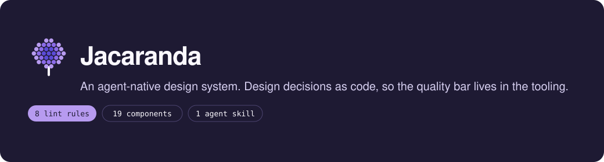

# Jacaranda



An agent-native design system. Design decisions as code, so the quality bar lives in the tooling.

The package on npm is [`@fracazo/design-system`](https://www.npmjs.com/package/@fracazo/design-system). **Jacaranda** is the name you say.

Built on [React 19+](https://react.dev) and [Tailwind v4](https://tailwindcss.com)

[](https://www.npmjs.com/package/@fracazo/design-system)
[](LICENSE)

**[Getting started](docs/getting-started.md)** · **[DESIGN.md](DESIGN.md)** · **[npm](https://www.npmjs.com/package/@fracazo/design-system)**

## Overview

When a team ships faster, the design review queue is the first thing that breaks. Either every change waits on a designer, or the bar drops quietly. Neither works.

Jacaranda moves the bar out of the review queue and into the tooling, where it holds whether a designer is in the room or not. It grew out of BirthGuide and birthplans.app: two products, two brand files, one system.

It ships nine lint rules, nineteen components with intent docs, a brand contract (core plus extensions), four bins, and eight agent skills. You import the roles, then exactly one brand file. Both people and AI assistants build from the same reference.

**What makes Jacaranda different:**

- **The roles never move.** Colour, radius, type and motion are named once in `css/roles.css`. A product keeps its own brand file. Change the file and the product reskins. Nothing brand-specific lives here.
- **Decisions sit where they get made.** Each component opens with use for, avoid when, and variants. The refuse-when is the system.
- **The bar lives in the tooling.** Eight ESLint rules catch what a reviewer would: colour literals, radius literals, stock palette, dark pairs, arbitrary sizes, focus rings, text on dark surfaces, em dashes. The build fails before anyone posts a screenshot.
- **Built for people and agents.** The skill, the rules and `DESIGN.md` are designed together, so a person and an AI assistant make the same call from the same ID.

## Getting started

Jacaranda requires **React 19** and **Tailwind v4**. The components also sit on a set of peers (radix-ui, lucide-react, react-hook-form, and the rest). A product that only wants the roles and guardrails can leave those uninstalled.

Start a product:

```bash
pnpm dlx --package @fracazo/design-system ds-init my-product
```

That writes Next 16, Tailwind v4, this package, a blank brand file and the guardrails on, pinned to the version that ran. It refuses a non-empty directory.

Or add it to an existing project:

```bash
pnpm add @fracazo/design-system
```

The full path, including two prompts you can paste into an AI coding tool, is in **[Getting started](docs/getting-started.md)**.

## What ships

| Surface | What it is |
|---|---|
| [`css/roles.css`](css/roles.css) | The system: dark variant, Tailwind v4 `@theme` mapping, radius ramp, fluid type, band rhythm, eight aliasing semantics, and the **brand contract** |
| [`css/motion.css`](css/motion.css) | Enter, exit, accordion, fade, zoom, blur and slide. `roles.css` imports it |
| [`@fracazo/design-system/ui/*`](src/ui) | Nineteen components (seventeen shadcn-based, plus house OfferCard and ArticleCard), each with intent JSDoc |
| [`@fracazo/design-system/eslint`](guardrails/eslint.ts) | Eight guardrails, one per rule ID |
| `ds-init` | Writes a new product from [`template/`](template) |
| `ds-check-brand` | Holds a brand file to the contract: nothing missing, nothing extra |
| `ds-build-brand-css` | Composes the public `brand.css` a product can serve |
| `ds-intake` | Collects design-relevant commits into a packet the agent proposes and a human commits |
| [`skills/product-design/`](skills/product-design) | The agent skill: request modes, routed references, stable rule IDs, exemplars |
| [`DESIGN.md`](DESIGN.md) | The written authority: reader, priority order, composition, reject list, one chapter per brand |

Brand files live in each product repo, not here. The contract is what keeps them honest.

## Principles

These are the promises the system makes to whoever builds on it.

- **Performance is the brand.** A fast page feels more premium than any palette.
- **Preserve the reader's decision.** Facts, options and consequences stay exact. Copy claims only what ships.
- **One brand file, no local tokens.** Never fork a component or invent a value in the product. A missing role is a proposal for this repo.
- **Spend emphasis once.** One focal relationship per screen. When a surface shouts, remove signals.
- **A rule is added only when the same correction has recurred.** Prefer a token, a lint rule or a contract entry that enforces itself.

## Architecture

### Roles

Two tiers. Primitives (`--brand`, `--band`, `--ink`) hold literals and live in the brand file. Eight semantics alias a primitive here and stay identical in light and dark. Six are meant to diverge in the brand file (secondary, muted, border, input, muted-foreground, accent-foreground). Write `bg-card` once. The token owns both themes.

### Components

Nineteen typed React components. Import from a per-component subpath so each one's client boundary stays where it declares it.

### The skill

Agents load `skills/product-design/SKILL.md` first. It names the request mode (shape, implement, review, copy, harden), routes to the reference that applies, and cites rules by stable ID. The system proposes. The human commits.

## Project structure

| Directory | Purpose |
|---|---|
| `src/` | `cn` and the nineteen components |
| `css/` | Roles, motion, the brand contract |
| `guardrails/` | The four bins and the ESLint plugin |
| `skills/product-design/` | Agent skill, rules, exemplars, intake |
| `template/` | What `ds-init` writes |
| `docs/` | Getting started |
| `brand/` | Jacaranda identity assets for this repo. Not a product brand |
| `studio/` | Recording kit for the X series. Not in the published tarball |
| `demo/` | Showcase page that renders a served `/brand.css` |

## Working in this repo

Feature branch, then a fast-forward merge to `main`. No pull requests. Australian English. Conventional Commits, present tense.

```bash
pnpm install
pnpm check
pnpm build
```

## Licence

MIT
